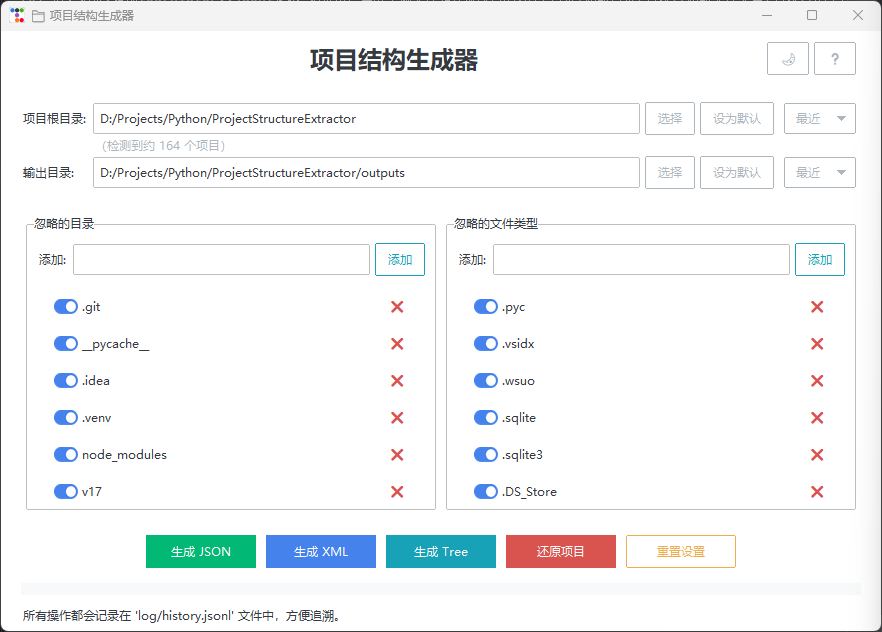
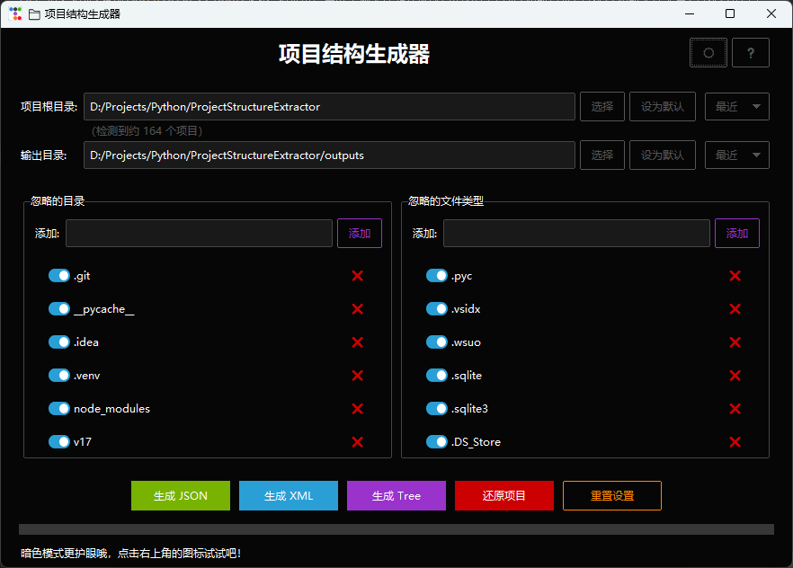
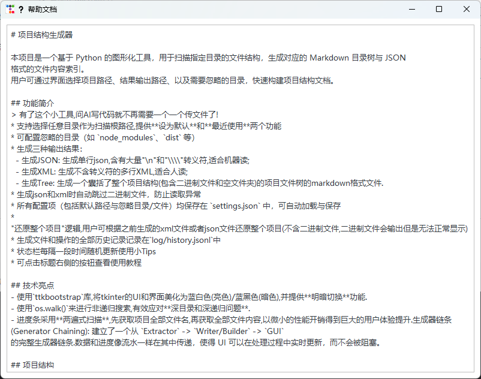
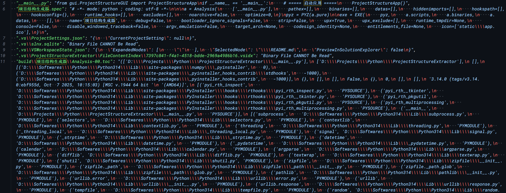

# 项目结构生成器

本项目是一个基于 Python 的图形化工具，用于扫描指定目录的文件结构，生成对应的 Markdown 目录树与 JSON 或 XML 格式的文件内容索引。
用户可通过界面选择项目路径、结果输出路径、以及需要忽略的目录，快速构建项目结构文档。

## 功能简介
> 有了这个小工具,问AI写代码就不再需要一个一个传文件了!
> 直接把生成的json/xml/tree喂给AI,AI直接就能弄懂!
* 支持选择任意目录作为扫描根路径,提供**设为默认**和**最近使用**两个功能
* 可配置忽略的目录（如 `node_modules`、`dist` 等）
* 生成三种输出结果： 
  - 生成JSON: 生成单行json,含有大量"\n"和"\\\\"转义符,适合机器读;
  - 生成XML: 生成不含转义符的多行XML,适合人读;
  - 生成Tree: 生成一个囊括了整个项目结构(包含二进制文件和空文件夹)的项目文件树的markdown格式文件.
* 生成json和xml时自动跳过二进制文件，防止读取异常
* 所有配置项（包括默认路径与忽略目录/文件）均保存在 `settings.json` 中，可自动加载与保存
* "还原整个项目"逻辑,用户可根据之前生成的xml文件或者json文件还原整个项目(不含二进制文件,二进制文件会输出但是无法正常显示)
* 生成文件和操作的全部历史记录记录在`log/history.jsonl`中
* 状态栏每隔一段时间随机更新使用小Tips
* 可点击标题右侧的按钮查看使用教程

## 技术亮点
- 使用`ttkbootstrap`库,将tkinter的UI和界面美化为蓝白色(亮色)/蓝黑色(暗色),并提供**明暗切换**功能.
- 使用`os.walk()`来进行非递归搜索,有效应对**深目录和深递归问题**.
- 进度条采用**两遍式扫描**,先获取项目全部文件名,再获取全部文件内容,以微小的性能开销得到巨大的用户体验提升.生成器链条 (Generator Chaining): 建立了一个从 `Extractor` -> `Writer/Builder` -> `GUI` 的完整生成器链条.数据和进度像流水一样在其中传递，使得 UI 可以在处理过程中实时更新，而不会被阻塞。

## 项目结构

```
📁 project_tree/
├── 📄 .gitignore
├── 📄 README.md
├── 📄 main.py
├── 📁 configure/
│   ├── 📄 init.py
│   └── 📄 defaultSettings.py
├── 📁 gui/
│   ├── 📄 ProjectStructureGUI.py
│   └── 📄 init.py
├── 📁 static/
└── 📁 utils/
    ├── 📄 HistoryLogger.py
    ├── 📄 JsonWriter.py
    ├── 📄 ProjectRestorer.py
    ├── 📄 ProjectStructureExtract.py
    ├── 📄 ProjectStructureTree.py
    ├── 📄 XmlWriter.py
    └── 📄 init.py

```

## 运行环境

* Python 3.9 及以上版本
* 依赖库：[requirements.txt](requirements.txt)

## 源代码运行方法

1. 运行程序：

   ```shell
   python __main__.py
   ```

2. 在界面中：

   * 选择项目根目录（Root Dir）
   * 选择输出目录（Result Dir）
   * (可选)可以将根目录或输出目录保存为默认值
   * 添加或移除忽略的文件夹和忽略的文件后缀名
   * 点击 “生成 JSON” 或 "生成XML" 或 “生成 Tree” 按钮即可输出结果
   * 点击 "还原项目" 并置入项目json或xml,选择输出目录,即可还原二进制文件外的整个项目

3. 程序将在输出目录中生成：

   * `project_content.json`
   * `project_content.xml`
   * `project_tree.md`

4. 将输出的文件喂给AI,AI就可以立刻获取整个项目的内容而不再需要手动上传一个个源文件!

## 打包为可执行程序

##### Windows
Windows 下生成可执行文件，可使用以下命令：

```bash
pip install pyinstaller
pyinstaller --noconsole --onefile --name "项目结构生成器" --icon=./static/app.ico __main__.py
```

生成的可执行文件位于 `dist/` 目录中，可直接运行。
将生成的exe文件放入指定文件夹(运行时同级会出现settings.json和log/history.jsonl),然后在桌面上创建一个exe文件的快捷方式即可.


## 功能截图
- 主界面(明)

- 主界面(暗)

- 帮助界面

- 生成文件树

- 生成结构JSON

- 生成多行XML


## 其他
##### [更新日志与未来展望](doc/CHANGELOG.md)