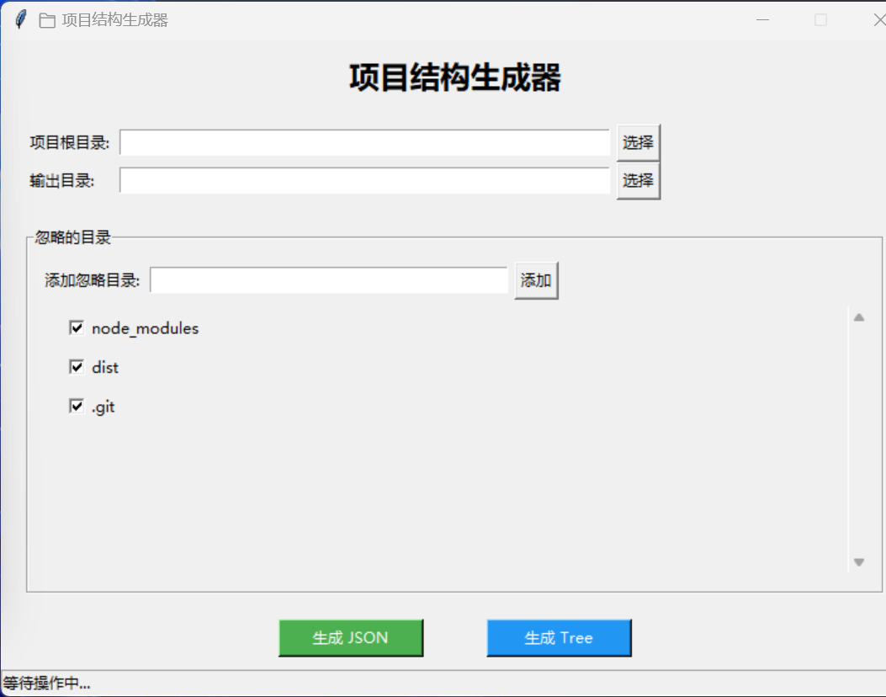
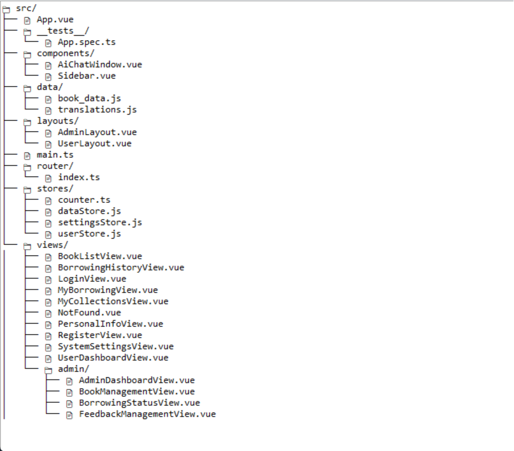
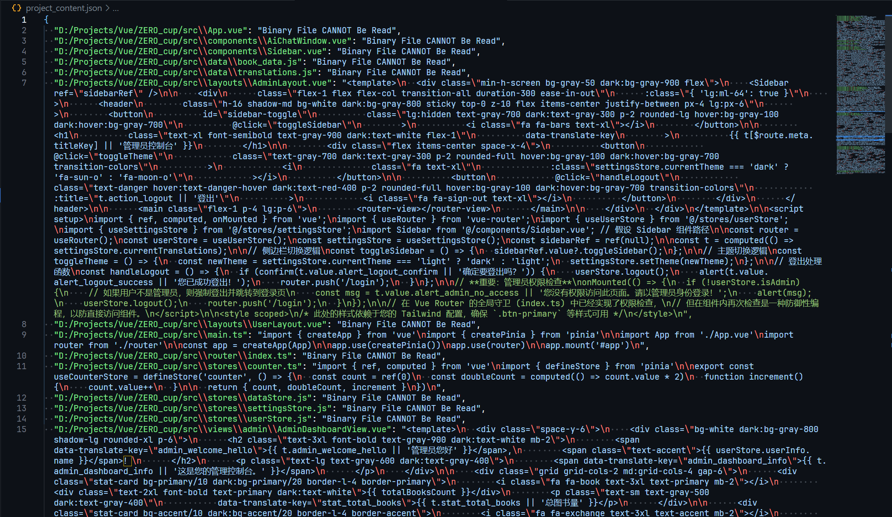
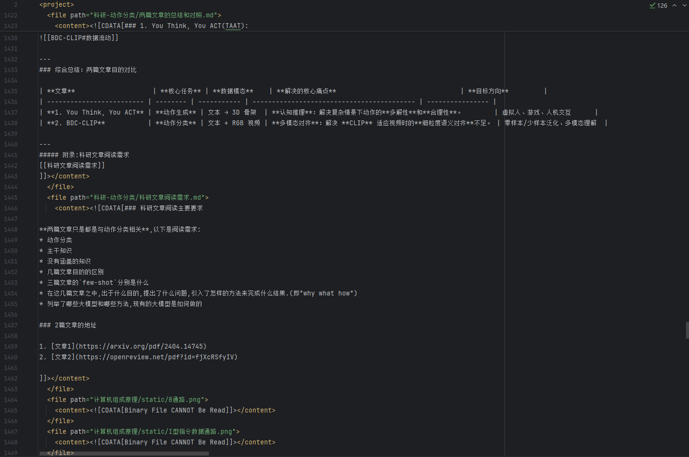

# 项目结构生成器

本项目是一个基于 Python 的图形化工具，用于扫描指定目录的文件结构，生成对应的 Markdown 目录树与 JSON 格式的文件内容索引。
用户可通过界面选择项目路径、结果输出路径、以及需要忽略的目录，快速构建项目结构文档。

## 功能简介
> 有了这个小工具,问AI写代码就不再需要一个一个传文件了!
* 支持选择任意目录作为扫描根路径
* 可配置忽略的目录（如 `node_modules`、`dist` 等）
* 生成两种输出结果：

  1. **project_content.json**：保存项目中每个文件的路径及其内容
  2. **project_tree.md**：以树形结构展示项目文件层级
* 自动跳过二进制文件，防止读取异常
* 所有配置项（包括默认路径与忽略目录/文件）均保存在 `settings.json` 中，可自动加载与保存

## 功能截图
- 项目主界面

- 生成文件树

- 生成结构JSON

- 生成多行XML

## 项目结构

```
./
├── JsonWriter.py              # JSON 文件写入器
├── ProjectStructureExtract.py # 目录扫描器
├── ProjectStructureTree.py    # 树形结构生成器
├── ProjectStructureGUI.py     # 主图形界面程序
├── globalConstants.py         # 全局常量定义
├── settings.json              # 默认配置文件
├── __main__.py                # 程序入口
└── README.md                  # README文件
```

## 运行环境

* Python 3.9 及以上版本
* 依赖库：

  ```bash
  pip install tkinter
  ```
  （部分 Python 环境已自带 tkinter）

## 使用方法

1. 运行程序：

   ```shell
   python __main__.py
   ```

2. 在界面中：

   * 选择项目根目录（Root Dir）
   * 选择输出目录（Result Dir）
   * (可选)可以将根目录或输出目录保存为默认值
   * 添加或移除忽略的文件夹
   * 修改需要忽略的文件后缀名
   * 点击 “生成 JSON” 或 "生成XML" 或 “生成 Tree” 按钮即可输出结果
        - 生成JSON: 生成单行json,含有大量"\n"和"\\\\"转义符,适合机器读;
        - 生成XML: 生成不含转义符的多行XML,适合人读;
        - 生成Tree: 生成一个囊括了整个项目结构(包含二进制文件和空文件夹)的项目文件树的markdown格式文件.

3. 程序将在输出目录中生成：

   * `project_content.json`
   * `project_content.xml`
   * `project_tree.md`

### 视频教程

<video src="./static/使用方法.mp4" controls width="600" height="400">
  您的浏览器不支持播放该视频。请下载 [使用方法.mp4](./static/使用方法.mp4) 进行观看。
</video>

或者您可以直接点击链接下载：[使用方法.mp4](./static/使用方法.mp4)

## 打包为可执行程序

##### Windows
Windows 下生成可执行文件，可使用以下命令：

```bash
pip install pyinstaller
pyinstaller --noconsole --onefile --name "项目结构生成器" --add-data "settings.json;." --icon=./static/app.ico __main__.py
```

生成的可执行文件位于 `dist/` 目录中，可直接运行。

[//]: # ()
[//]: # (##### MacOS)

[//]: # (在MacOS中,在终端执行:)

[//]: # (```bash)

[//]: # (pip install pyinstaller)

[//]: # (pyinstaller --noconsole --name "项目结构生成器" --add-data "settings.json:." --icon=static/app.icns __main__.py)

[//]: # (```)

[//]: # (打包好的可执行文件会在：)

[//]: # (`dist/项目结构生成器.app`)
## 许可协议

本项目仅用于学习与研究目的，作者保留最终解释权。
